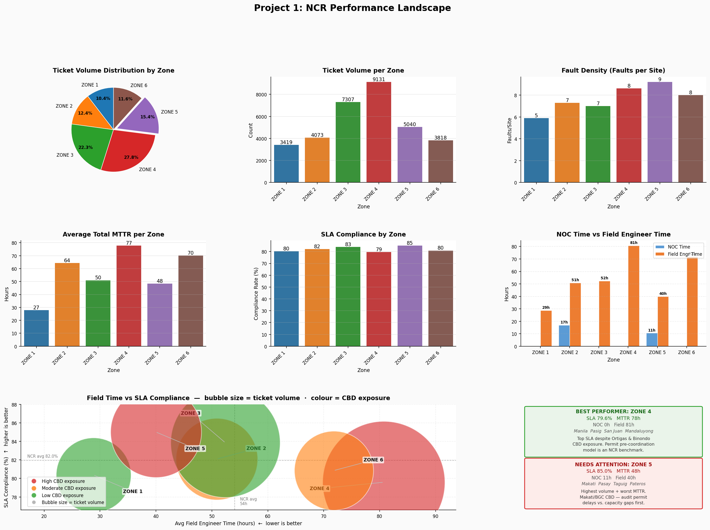

# Telecom Fault Ticket Analysis: NCR

## Overview
This repository documents an end-to-end analysis of ~37,000 Priority 1–3 fault tickets across six operational zones in the National Capital Region (NCR). 

The work spans pipeline engineering, KPI modelling, zone benchmarking, site risk profiling, and field engineer workload analysis.

All personal and site-identifying data has been anonymised. 
Raw ticket data is not included in this repository.

## Data Notice

The notebooks and their outputs were produced using a proprietary operational
dataset that cannot be distributed. A synthetic dataset is provided for
reproducibility. It is calibrated to reproduce the exact zone-level KPIs
of the original data (ticket counts, SLA%, MTTR, and resolution path split)
but does not reproduce city- or site-level figures exactly.

**What this means:**
- The pipeline, metrics, and analytical logic are fully reproducible using
  the synthetic data.
- Notebook commentary, charts, and findings reflect the original dataset.
  Running the notebooks on synthetic data will produce structurally identical
  outputs with minor numerical differences at the city and site level.

Synthetic data can be generated using the `00_synthetic_data_generator`
notebook in `notebooks/project1_ncr_baseline/`.

## Example Outputs
The analysis produces operational KPIs and benchmarking visualisations
across telecom zones in the NCR. Key insights include MTTR, SLA compliance,
fault density, and engineer workload metrics.

### Comprehensive Analysis


This figure includes:

- Ticket Volume Distribution by Zone  
- Ticket Volume per Zone  
- Fault Density (Faults per Site)  
- Average Total MTTR per Zone  
- SLA Compliance by Zone  
- NOC/ROC Time vs Field Engineer Time  
- Field Time vs SLA Compliance (bubble graph)

## What This Repository Demonstrates

This project demonstrates practical data engineering and analytics
skills applied to telecom operations data:

- Building a modular **data pipeline** for cleaning and standardising
  operational fault ticket data
- Implementing **domain-specific metrics** such as MTTR, SLA compliance,
  and fault density
- Designing **zone-level benchmarking frameworks** for operational performance
- Developing **risk profiling methods** for telecom sites and infrastructure
- Creating **engineer workload and dispatch analysis** for operational planning
- Writing **testable, modular Python code** for analytics pipelines

## Key Topics
- Telecom fault ticket analysis
- SLA compliance and MTTR modelling
- Zone performance benchmarking
- Site-level risk profiling
- Field engineer workload analysis

## Project Series
The analysis is organised into a series of focused projects:

| # | Project | Focus | Status |
|---|---------|-------|--------|
| P1 | NCR Baseline | Zone-level MTTR, SLA, fault density | Complete |
| P2 | Resolution Paths | Field dispatch anatomy, RFO breakdown, Zone 1 site risk | Pending |
| P3 | Zone Benchmarking | Priority-adjusted scorecard, P3.2 breach deep-dive | Pending |
| P4 | City Intelligence | City-level risk scoring, composite index | Pending |
| P5 | Site & Engineer Risk | Site risk profiling, field engineer load equity | Pending |

## Repository Structure
```
├── docs/        # Design decisions and project documentation
│   ├── data_dictionary.md
│   └── pipeline_decisions.md
├── notebooks/   # Analysis notebooks (including synthetic data generator)
│   └── project1_ncr_baseline/
│       ├── 00_synthetic_data_generator.ipynb
│       ├── 01_data_quality_assessment.ipynb
│       ├── 02_cleaned_data_analysis.ipynb
│       └── ...
├── output/      # Processed datasets and KPI summaries
│   ├── ncr_summary.csv
│   └── data_validation_report.csv
├── reports/     # Figures and visual outputs
│   └── figures/
│       └── project1_ncr/
│           ├── 02_quick_checks.png
│           └── ...
├── src/         # Pipeline and analysis modules
├── tests/       # Unit tests for pipeline and metrics
├── LICENSE
├── README.md
├── config.py
├── loading.py
└── requirements.txt
```

## Status
🔧 Pipeline and source modules: complete  
📓 Notebooks: being published in stages

## Setup
Clone the repository and install dependencies:

```bash
pip install -r requirements.txt
```

To reproduce the analysis:
1. Run the synthetic data generator notebook
    `notebooks/project1_ncr_baseline/00_synthetic_data_generator.ipynb`

2. Run the cleaning and preprocessing workflow
    `notebooks/project1_ncr_baseline/02_cleaned_data_analysis.ipynb`

3. Additional analysis notebooks in
    `notebooks/project1_ncr_baseline/`

> Notebooks generate `output/cleaned_fault_ticket.csv`, which is used
> by subsequent analysis steps.
